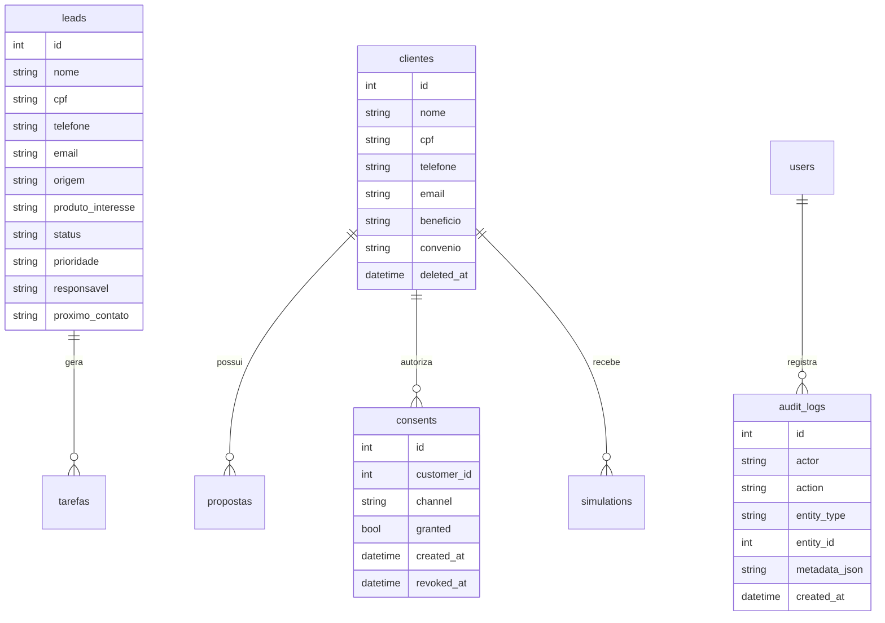

# Modelo de Dados - BBB Consig CRM

## Banco atual
SQLite local em `backend/app.db`, com migrations em `backend/migrations`.

## Tabelas existentes
- `leads`
- `clientes`
- `propostas`
- `tarefas`
- `whatsapp_messages`

## Tabelas de seguranca/LGPD
- `users`
- `audit_logs`
- `consents`
- `simulations`

## Campos sensiveis
- CPF
- Telefone
- Email
- Beneficio
- Banco de pagamento
- Observacoes quando contiverem dados pessoais

## Campos que precisam de protecao
- `leads.cpf`, `leads.telefone`, `leads.email`
- `clientes.cpf`, `clientes.telefone`, `clientes.email`, `clientes.beneficio`, `clientes.banco_pagamento`
- payloads de simulacao e metadados de auditoria

## Audit log obrigatorio
- Login
- Criacao/edicao/soft delete de cliente
- Registro de opt-in
- WhatsApp simulado
- Simulacao INSS/FGTS

## Soft delete
Tabelas com dados pessoais devem usar `deleted_at` antes de remocao definitiva.

## ERD

