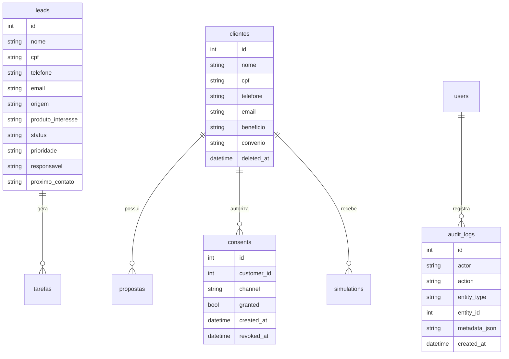

# Modelo de Dados - BBB Consig CRM

## Banco atual
SQLite local em `backend/app.db`, com migrations em `backend/migrations`, permanece restrito a desenvolvimento, testes locais e MVP controlado.

## Producao real
Producao real com dados de clientes exige PostgreSQL gerenciado via `DATABASE_URL` configurada somente no painel seguro do provedor. Nunca commitar URL real de banco e nunca colar `DATABASE_URL` real no chat.

As migrations seguem estrategia separada por banco:
- `backend/migrations/*.sql` e `backend/migrations/sqlite/*.sql`: legado SQLite/local/MVP controlado.
- `backend/migrations/postgres/*.sql`: migrations PostgreSQL formais para producao real futura.

`Base.metadata.create_all` pode ser usado como bootstrap local/controlado, mas nao e a estrategia final de producao real. Em PostgreSQL com `APP_ENV=production`, schema e migrations devem ser aplicados formalmente depois de banco gerenciado, backup/restore e aprovacao explicita.

Uso com dados reais continua bloqueado ate concluir criptografia em repouso, autenticacao segura, backup/restore, monitoramento, revisao LGPD e aprovacao final do dono.

## Schema PostgreSQL inicial

Status: DEFINIDO PARA DRY RUN EM BANCO VAZIO. Nao autoriza aplicacao no Supabase real, dados reais ou publicacao.

Um Supabase vazio precisa receber uma migration bootstrap PostgreSQL antes das migrations aditivas. O schema inicial deve conter somente tabelas usadas pelo CRM:

| Tabela | Finalidade | Requisitos iniciais |
| --- | --- | --- |
| `leads` | Captacao e funil de leads | `id`, dados de contato, status, prioridade, soft delete, campos protegidos, `created_at`, `updated_at` |
| `clientes` | Cadastro de clientes ficticios/controlados | `id`, dados cadastrais, convenio, soft delete, campos protegidos, `created_at`, `updated_at` |
| `propostas` | Propostas simuladas | `id`, `cliente_id`, produto, banco, valores simulados, soft delete, `created_at`, `updated_at` |
| `tarefas` | Pendencias operacionais | `id`, responsavel, vinculos opcionais com lead/cliente, soft delete, `created_at`, `updated_at` |
| `whatsapp_messages` | Historico de WhatsApp simulado | `id`, destinatario, telefone, modelo, mensagem, soft delete, `created_at`, `updated_at` |
| `users` | Usuarios internos do MVP controlado | `id`, email unico, senha hash, papel, ativo, `created_at`, `updated_at` |
| `audit_logs` | Auditoria tecnica e operacional | `id`, ator, acao, entidade, metadados mascarados, `created_at`, `updated_at` |
| `consents` | Registro de consentimento/opt-in | `id`, cliente, canal, finalidade, status, revogacao, soft delete, `created_at`, `updated_at` |
| `simulations` | Simulacoes INSS/FGTS ficticias | `id`, cliente opcional, CPF mascarado, produto, regra, payload, hash, soft delete, `created_at`, `updated_at` |

Tabelas criadas por migrations posteriores continuam fora do bootstrap quando ja possuem migration propria:
- `auth_sessions`: criada por `2026_07_12_auth_sessions.sql`.
- `backup_audit_logs`: criada por `2026_07_12_real_data_readiness.sql`.
- `admin_bootstrap_tokens`: criada por `2026_07_15_first_admin_bootstrap.sql`.

A ordem PostgreSQL para um banco vazio deve ser:

1. `2026_07_01_000_postgres_bootstrap_schema.sql`
2. `2026_07_02_postgres_preparacao.sql`
3. `2026_07_12_auth_sessions.sql`
4. `2026_07_12_real_data_readiness.sql`
5. `2026_07_12_backend_only_permissions.sql`
6. `2026_07_15_first_admin_bootstrap.sql`

Rollback do bootstrap em ambiente temporario deve ser feito descartando o banco temporario ou restaurando snapshot anterior. Nao ha `DROP` versionado para ambiente real, pois a cadeia foi desenhada para ser aditiva e auditavel.

## Permissoes PostgreSQL BACKEND-ONLY

Status: DEFINIDO PARA REVISAO. Nao autoriza apply no Supabase real.

A tabela de dados do CRM deve ser acessada somente pelo backend. A migration `2026_07_12_backend_only_permissions.sql` revoga acesso direto de `PUBLIC`, `anon` e `authenticated` nas 12 tabelas:

- `audit_logs`
- `auth_sessions`
- `backup_audit_logs`
- `clientes`
- `consents`
- `leads`
- `propostas`
- `schema_migrations`
- `simulations`
- `tarefas`
- `users`
- `whatsapp_messages`

Regras:
- `anon` nao deve ter `SELECT`, `INSERT`, `UPDATE`, `DELETE`, `TRUNCATE`, `REFERENCES` ou `TRIGGER`.
- `authenticated` nao deve ter acesso direto as tabelas.
- `PUBLIC` nao deve ter acesso direto ao schema/tabelas/sequences.
- `postgres` permanece preservado como owner/administrador tecnico.
- `service_role` nao e exposto no frontend; qualquer uso futuro deve ficar fora do Git e em ambiente seguro do backend.
- Novas tabelas e sequences nao devem herdar grants publicos por default privileges.
- RLS pode ser adicionado como camada extra futura, mas a decisao atual e `BACKEND-ONLY`.

## Preparacao proposta para piloto interno

Status: PROPOSTO PARA APROVACAO.

A nova fundacao tecnica deve preservar o modo demo e preparar campos adicionais para uso futuro:
- `deleted_by` e `deletion_reason` junto de `deleted_at` nas tabelas com dados pessoais ou comunicacao.
- `cpf_hash` para busca deterministica sem indexar CPF puro.
- `cpf_encrypted`, `telefone_encrypted`, `email_encrypted` e `bank_data_encrypted` para protecao por envelope criptografado versionado com Fernet.
- `purpose`, `status`, `revoked_by` e `metadata_json` em consentimentos.
- `backup_audit_logs` para registrar testes e rotinas de backup/restauracao sem guardar segredo.
- `auth_sessions` para registrar sessoes autenticadas com hash do identificador, expiracao e revogacao server-side.

Esses campos nao liberam dados reais automaticamente. Eles apenas criam compatibilidade para um piloto interno futuro.

## Tabelas existentes
- `leads`
- `clientes`
- `propostas`
- `tarefas`
- `whatsapp_messages`

## Tabelas de seguranca/LGPD
- `users`
- `auth_sessions`
- `admin_bootstrap_tokens`
- `audit_logs`
- `consents`
- `simulations`

`auth_sessions` armazena somente hash do `sid`, usuario, `created_at`, `expires_at`, `revoked_at` e motivo de revogacao. O token completo nao deve ser persistido em banco ou logs.

`admin_bootstrap_tokens` armazena somente hash SHA-256 do token de ativacao, e-mail normalizado, proposito, expiracao, uso, origem segura e identificador da execucao GitHub quando disponivel. O token aberto nunca deve ser persistido. Tokens expiram em ate 60 minutos, sao de uso unico e ficam restritos ao fluxo de primeiro administrador real/recuperacao administrativa do mesmo e-mail.

Todas as tabelas possuem `id`, `created_at` e `updated_at`. Campos legados como `data_criacao` e `criado_em` permanecem para compatibilidade do MVP.

## Campos sensiveis
- CPF
- Telefone
- Email
- RG, se vier a ser criado em etapa futura
- Endereco, se vier a ser criado em etapa futura
- Agencia e conta, se vierem a ser criadas em etapa futura
- Beneficio
- Banco de pagamento
- Observacoes quando contiverem dados pessoais
- Dados financeiros de proposta: valor liberado, parcela, prazo e banco

## Campos que precisam de protecao
- `leads.cpf`, `leads.telefone`, `leads.email`
- `clientes.cpf`, `clientes.telefone`, `clientes.email`, `clientes.beneficio`, `clientes.banco_pagamento`
- `propostas.banco`, `propostas.valor_liberado`, `propostas.parcela`, `propostas.prazo`
- payloads de simulacao e metadados de auditoria

## Protecao em modo demo
Com `APP_MODE=demo`, o backend bloqueia CPF matematicamente valido em cadastros e simulacoes. O objetivo e reduzir risco de insercao acidental de dado real enquanto o sistema permanece em MVP controlado.

Essa validacao nao substitui criptografia em repouso. Ela tambem nao e regra definitiva de producao: uma liberacao futura exigira ADR, chave segura, rotacao, backup/restore e revisao LGPD.

## Audit log obrigatorio
- Login
- Criacao/edicao/soft delete de cliente
- Registro de opt-in
- WhatsApp simulado
- Simulacao INSS/FGTS

## Soft delete
Tabelas com dados pessoais devem usar `deleted_at` antes de remocao definitiva.

Status proposto:
- `clientes`, `leads`, `propostas`, `tarefas`, `whatsapp_messages`, `consents` e `simulations` devem ter `deleted_at`, `deleted_by` e `deletion_reason`.
- Restauracao administrativa deve registrar auditoria e nunca apagar historico.
- Exclusao definitiva permanece politica futura documentada, nao implementada como rotina automatica nesta etapa.

## ERD

