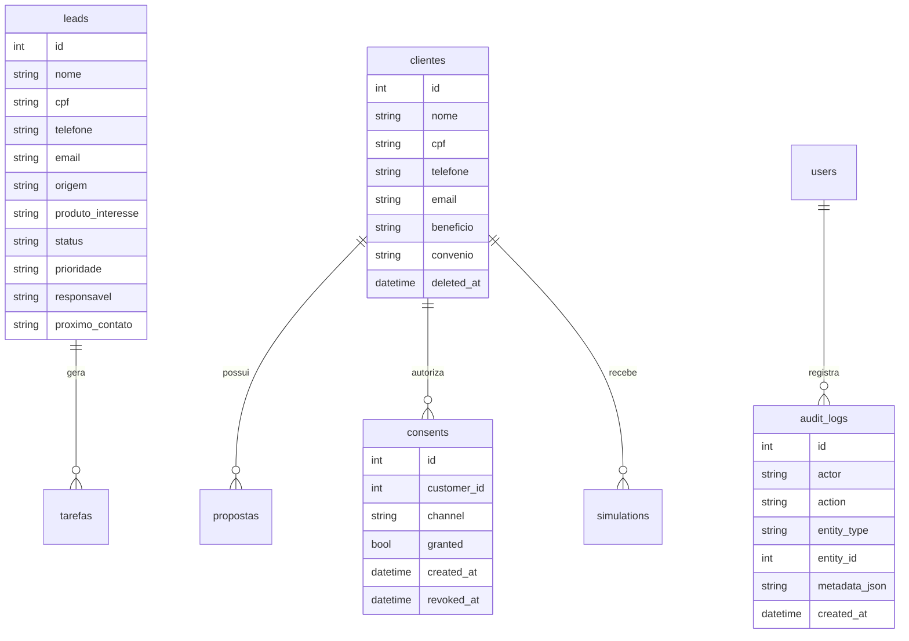

# Modelo de Dados - BBB Consig CRM

## Banco atual
SQLite local em `backend/app.db`, com migrations em `backend/migrations`, permanece restrito a desenvolvimento, testes locais e MVP controlado.

## Producao real
Producao real com dados de clientes exige PostgreSQL gerenciado via `DATABASE_URL` configurada somente no painel seguro do provedor. Nunca commitar URL real de banco e nunca colar `DATABASE_URL` real no chat.

As migrations seguem estrategia separada por banco:
- `backend/migrations/*.sql` e `backend/migrations/sqlite/*.sql`: legado SQLite/local/MVP controlado.
- `backend/migrations/postgres/*.sql`: migrations PostgreSQL formais para producao real futura.

`Base.metadata.create_all` pode ser usado como bootstrap local/controlado, mas nao e a estrategia final de producao real. Em PostgreSQL com `APP_ENV=production`, schema e migrations devem ser aplicados formalmente depois de banco gerenciado, backup/restore e aprovacao explicita.

Uso com dados reais continua bloqueado ate concluir criptografia em repouso, autenticacao segura, backup/restore, monitoramento e revisao LGPD.

## Tabelas existentes
- `leads`
- `clientes`
- `propostas`
- `tarefas`
- `whatsapp_messages`

## Tabelas de seguranca/LGPD
- `users`
- `audit_logs`
- `consents`
- `simulations`

Todas as tabelas possuem `id`, `created_at` e `updated_at`. Campos legados como `data_criacao` e `criado_em` permanecem para compatibilidade do MVP.

## Campos sensiveis
- CPF
- Telefone
- Email
- RG, se vier a ser criado em etapa futura
- Endereco, se vier a ser criado em etapa futura
- Agencia e conta, se vierem a ser criadas em etapa futura
- Beneficio
- Banco de pagamento
- Observacoes quando contiverem dados pessoais
- Dados financeiros de proposta: valor liberado, parcela, prazo e banco

## Campos que precisam de protecao
- `leads.cpf`, `leads.telefone`, `leads.email`
- `clientes.cpf`, `clientes.telefone`, `clientes.email`, `clientes.beneficio`, `clientes.banco_pagamento`
- `propostas.banco`, `propostas.valor_liberado`, `propostas.parcela`, `propostas.prazo`
- payloads de simulacao e metadados de auditoria

## Protecao em modo demo
Com `APP_MODE=demo`, o backend bloqueia CPF matematicamente valido em cadastros e simulacoes. O objetivo e reduzir risco de insercao acidental de dado real enquanto o sistema permanece em MVP controlado.

Essa validacao nao substitui criptografia em repouso. Ela tambem nao e regra definitiva de producao: uma liberacao futura exigira ADR, chave segura, rotacao, backup/restore e revisao LGPD.

## Audit log obrigatorio
- Login
- Criacao/edicao/soft delete de cliente
- Registro de opt-in
- WhatsApp simulado
- Simulacao INSS/FGTS

## Soft delete
Tabelas com dados pessoais devem usar `deleted_at` antes de remocao definitiva.

Status atual:
- `clientes`: possui `deleted_at` e exclusao logica.
- `leads`, `propostas`, `tarefas`, `whatsapp_messages`, `consents`, `simulations`: ainda nao possuem soft delete padronizado. A expansao exige migration versionada e plano de compatibilidade.

## ERD

